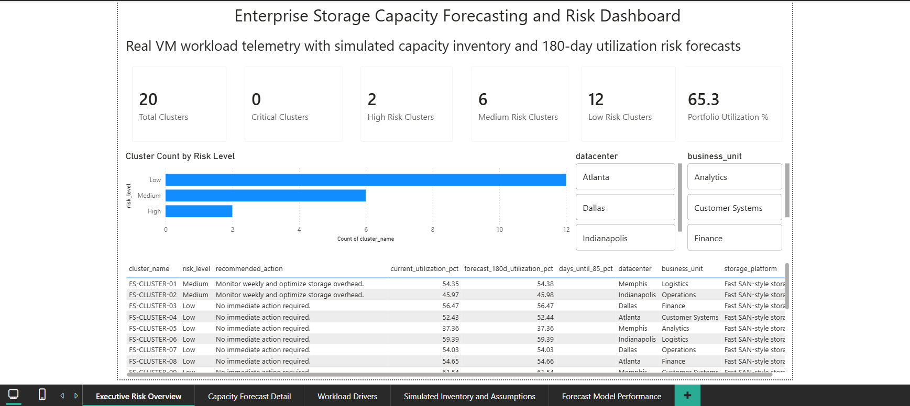
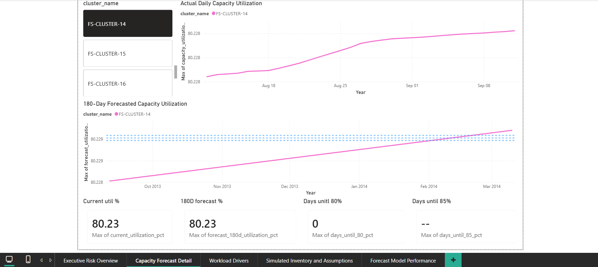
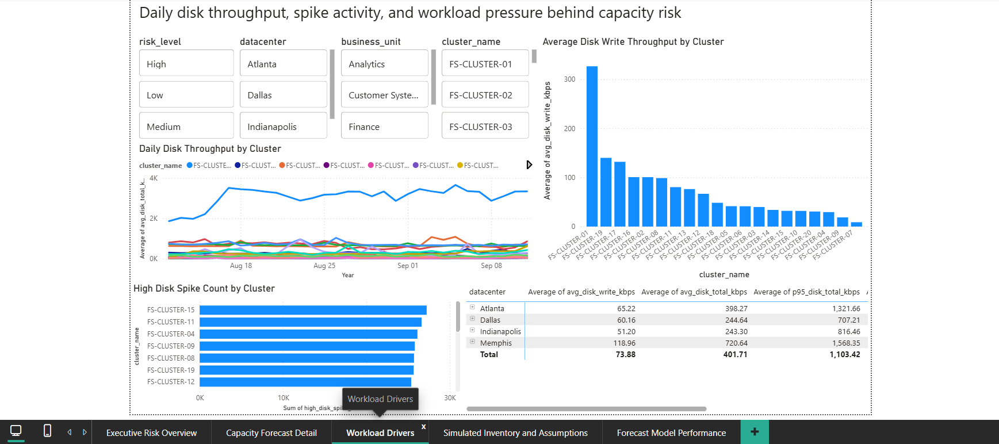
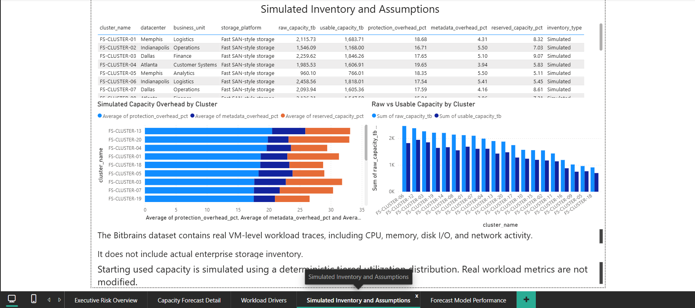
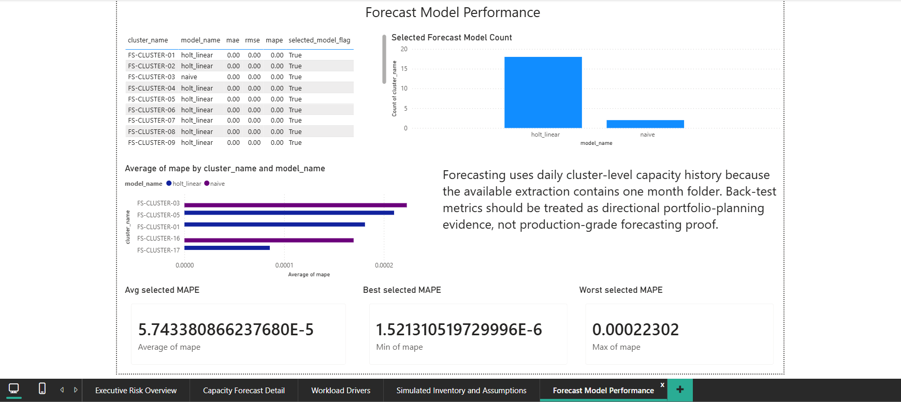

# Enterprise Storage Capacity Forecasting and Risk Dashboard

## 1. Business Problem

Enterprise infrastructure teams need to know which storage clusters are likely to exceed utilization risk thresholds in the next 3 to 6 months so that leadership can authorize expansion, migration, or decommission actions before a capacity crisis occurs.

This project builds an end-to-end storage capacity forecasting pipeline: from raw VM workload traces, through daily cluster aggregation, simulated capacity inventory, multi-model forecasting, and risk scoring, to eight Power BI-ready export tables.

---

## 2. Dataset

**Source:** [GWA-Bitbrains dataset](https://www.kaggle.com/datasets/nickhould/gwa-bitbrains) via Kaggle.

The Bitbrains dataset contains real VM-level datacenter workload traces from a commercial managed-hosting provider. Each trace file records 5-minute interval measurements for one virtual machine covering CPU, memory, disk I/O, and network throughput.

**What the dataset contains (real):**

- Timestamp (Unix seconds)
- CPU cores and CPU capacity provisioned
- CPU usage
- Memory capacity provisioned and memory usage
- Disk read throughput (KB/s)
- Disk write throughput (KB/s)
- Network received and transmitted throughput (KB/s)

**What the dataset does not contain:**

The Bitbrains dataset does not include actual enterprise storage inventory. Raw capacity, usable capacity, protection overhead, metadata overhead, datacenter ownership, business unit ownership, and recommended actions were simulated to create a realistic capacity planning layer for portfolio demonstration.

**Extraction available:**

- Trace type found: `fastStorage`
- Source month folder: `2013-8`
- Raw CSV files: 1,250 (one file per VM)
- Raw ingested rows: 11,221,800

---

## 3. Tools Used

| Tool | Purpose |
|---|---|
| Python 3 | Pipeline scripting |
| pandas | Data ingestion, aggregation, feature engineering |
| numpy | Deterministic simulation, numerical operations |
| statsmodels | Holt linear trend, exponential smoothing forecasting |
| scikit-learn metrics | MAE, RMSE, MAPE backtest evaluation |
| pyarrow | Parquet storage for intermediate VM data |
| Power BI Desktop | Manual dashboard layer (CSV import) |

---

## 4. Repository Structure

```
data_centre/
├── data/
│   ├── raw/
│   │   └── fastStorage/
│   │       └── 2013-8/          # 1,250 raw VM trace CSVs
│   └── processed/               # All pipeline outputs
├── docs/
│   ├── data_assumptions.md
│   ├── implementation_plan.md
│   ├── limitations.md
│   ├── methodology.md
│   ├── powerbi_dashboard_plan.md
│   └── validation_checklist.md
├── src/
│   ├── 00_profile_raw_data.py
│   ├── 01_ingest_bitbrains.py
│   ├── 02_feature_engineering.py
│   ├── 03_assign_clusters.py
│   ├── 04_build_monthly_cluster_metrics.py
│   ├── 05_create_capacity_inventory.py
│   ├── 06_estimate_capacity_usage.py
│   ├── 07_forecasting_backtest.py
│   ├── 08_capacity_risk_scoring.py
│   └── 09_generate_powerbi_tables.py
├── tests/
│   ├── test_stage_5_create_capacity_inventory.py
│   ├── test_stage_6_estimate_capacity_usage.py
│   ├── test_stage_7_forecasting_backtest.py
│   ├── test_stage_8_capacity_risk_scoring.py
│   └── test_stage_9_generate_powerbi_tables.py
├── requirements.txt
└── README.md
```

---

## 5. Pipeline Stages

| Stage | Script | Output |
|---|---|---|
| 0 | `00_profile_raw_data.py` | `raw_data_profile.csv`, `docs/data_profile_summary.md` |
| 1 | `01_ingest_bitbrains.py` | `vm_metrics_cleaned.parquet`, `vm_metrics_sample.csv` |
| 2 | `02_feature_engineering.py` | `vm_daily_metrics.csv` |
| 3 | `03_assign_clusters.py` | `vm_cluster_mapping.csv` |
| 4 | `04_build_monthly_cluster_metrics.py` | `cluster_daily_metrics.csv`, `cluster_monthly_metrics.csv` |
| 5 | `05_create_capacity_inventory.py` | `capacity_inventory.csv` |
| 6 | `06_estimate_capacity_usage.py` | `cluster_capacity_daily.csv`, `cluster_capacity_monthly.csv` |
| 7 | `07_forecasting_backtest.py` | `forecast_results.csv`, `model_backtest_results.csv` |
| 8 | `08_capacity_risk_scoring.py` | `capacity_risk_summary.csv` |
| 9 | `09_generate_powerbi_tables.py` | 8 `pbi_*.csv` export files |
| 10 | *(documentation)* | `README.md`, `docs/methodology.md`, `docs/limitations.md` |

Each stage reads validated outputs from the prior stage and writes named artifacts under `data/processed/`. A stage fails loudly if its stop condition is not met.

---

## 6. Parsing and Ingestion Decisions

Raw Bitbrains CSV files use a semicolon delimiter with optional whitespace or tab after each semicolon. Some rows are wrapped in an outer pair of double quotes. Plain `pd.read_csv()` cannot handle this format without safeguards.

**Parser rules applied:**

- Strip one pair of outer double quotes from each row before splitting.
- Split on semicolon plus optional whitespace or tab (equivalent to regex `;\s*`).
- Require exactly 11 fields per row; reject rows with fewer or more.
- Reject any dataframe with only one column as a parsing failure.
- Infer timestamp unit from numeric magnitude: values near 1,000,000,000 are Unix seconds; values near 1,000,000,000,000 are Unix milliseconds. The header says `Timestamp [ms]` but sample values such as `1376314846` map to 2013 as Unix seconds.
- Log failed parse counts; abort if the failed rate exceeds 5%.

**Ingestion result:** 11,221,800 rows from 1,250 VM trace files, all mapping to August 2013 dates.

---

## 7. Feature Engineering

Stage 2 collapses raw 5-minute interval VM telemetry into one row per VM per day.

**Engineered daily features:**

| Feature | Description |
|---|---|
| `avg_cpu_usage` | Mean CPU usage across 5-minute intervals |
| `avg_memory_usage_kb` | Mean memory usage |
| `memory_utilization_pct` | Mean memory usage / memory capacity provisioned × 100 |
| `p95_memory_utilization_pct` | 95th percentile memory utilization |
| `avg_disk_read_kbps` | Mean disk read throughput (KB/s) |
| `avg_disk_write_kbps` | Mean disk write throughput (KB/s) |
| `avg_disk_total_kbps` | Sum of read and write throughput |
| `p95_disk_total_kbps` | 95th percentile disk total throughput |
| `high_disk_spike_count` | Intervals where disk total exceeded the 95th percentile |
| `avg_network_rx_kbps` | Mean network received throughput |
| `avg_network_tx_kbps` | Mean network transmitted throughput |

Negative disk throughput values are rejected. Memory utilization anomalies are counted and logged. Output: 37,124 daily VM metric rows.

---

## 8. Simulated Capacity Inventory

The Bitbrains dataset does not include storage inventory. Stage 5 creates clearly labeled simulated capacity inventory using a deterministic seed (`numpy.random.default_rng(42)`) so the portfolio is reproducible.

**Simulation design:**

- 20 clusters, each corresponding to one simulated storage system.
- Fast SAN-style clusters: raw capacity 800–2,500 TB; usable capacity 72–82% of raw.
- Mixed SAN/NAS-style clusters: raw capacity 500–1,800 TB; usable capacity 65–78% of raw.
- Every cluster carries `inventory_type = Simulated`.
- Simulated fields per cluster: `datacenter`, `business_unit`, `storage_platform`, `raw_capacity_tb`, `usable_capacity_tb`, `protection_overhead_pct`, `metadata_overhead_pct`, `reserved_capacity_pct`, `recommended_action`.

These fields have no connection to any real enterprise storage environment.

---

## 9. Capacity Usage Estimation

Stage 6 attaches a capacity time series to each simulated cluster by using real disk write workload pressure as the growth driver.

**Method:**

Starting used capacity is simulated using a deterministic tiered utilization distribution to create realistic portfolio capacity-planning scenarios. Real workload metrics are not modified.

- Starting utilization is drawn from a tiered distribution (35%–70% of usable capacity), seeded deterministically.
- Daily growth is estimated from disk write throughput: `daily_write_tb = avg_disk_write_kbps × 86,400 seconds / (1024³ KB per TB)`.
- A `retention_factor = 0.08` converts gross write activity to net new retained storage.
- Capacity utilization is `used_capacity_tb / usable_capacity_tb × 100`.

**Output:** 620 daily capacity rows (20 clusters × 31 days), 40 monthly summary rows.

---

## 10. Forecasting and Backtesting

Because the available Kaggle extraction contains one month folder, forecasting is performed on daily cluster-level capacity history and then summarized into 30-day, 90-day, and 180-day planning windows.

**Candidate models:**

| Model | Description |
|---|---|
| `naive` | Last observed value carried forward |
| `moving_average_7d` | 7-day rolling mean |
| `holt_linear` | Holt linear trend (double exponential smoothing) |
| `exp_smoothing` | Simple exponential smoothing |

**Backtesting:**

- Training split: earliest 70–80% of daily observations per cluster.
- Test split: remaining 20–30% of daily observations.
- Metrics: MAE, RMSE, MAPE.
- Model selection: lowest MAPE on the test window.
- If daily history is too short for meaningful backtesting, a limited-history fallback is applied and documented.

**Results:**

- Holt linear trend selected for 18 of 20 clusters.
- Naive model selected for 2 of 20 clusters.
- Forecast horizon: 180 days per cluster.
- Total forecast rows: 3,600 (20 clusters × 180 days).
- Each forecast row includes `breach_80_flag`, `breach_85_flag`, `breach_90_flag` for threshold tracking.

---

## 11. Risk Scoring Logic

Stage 8 combines the last actual utilization, monthly growth rate, and 30-day, 90-day, and 180-day forecast utilization to assign each cluster a risk level and a recommended action.

**Risk rules (evaluated in priority order):**

| Risk Level | Rule |
|---|---|
| Critical | Current utilization ≥ 90%, or 30-day forecast ≥ 90% |
| High | 90-day forecast ≥ 85%, or 30-day forecast ≥ 85% |
| Medium | 180-day forecast ≥ 80% |
| Low | All forecasts below 80% |

**Recommended actions by risk level:**

- Critical: Immediate expansion required
- High: Plan expansion within 90 days
- Medium: Monitor and schedule review
- Low: No action required

**Result (20 clusters):**

| Risk Level | Count |
|---|---|
| Critical | 0 |
| High | 2 |
| Medium | 6 |
| Low | 12 |

---

## 12. Power BI Export Tables

Stage 9 exports eight clean CSV files for the Power BI dashboard. No index columns. Dates in `YYYY-MM-DD` format. Percentages in 0–100 format.

| File | Rows | Purpose |
|---|---|---|
| `pbi_cluster_daily_metrics.csv` | 620 | Workload driver analysis by cluster and date |
| `pbi_cluster_monthly_metrics.csv` | 40 | Monthly workload summary |
| `pbi_capacity_inventory.csv` | 20 | Simulated inventory with `inventory_type = Simulated` |
| `pbi_cluster_capacity_daily.csv` | 620 | Daily capacity utilization history |
| `pbi_cluster_capacity_monthly.csv` | 40 | Monthly capacity summary |
| `pbi_forecast_results.csv` | 3,600 | 180-day utilization forecasts with breach flags |
| `pbi_model_backtest_results.csv` | 80 | Backtest MAE, RMSE, MAPE, selected model flag |
| `pbi_capacity_risk_summary.csv` | 20 | Executive risk summary with recommended actions |

---

## 13. Dashboard Design

The Power BI dashboard has five pages. See [docs/powerbi_dashboard_plan.md](docs/powerbi_dashboard_plan.md) for the full layout specification.

**Page 1 – Executive Risk Overview:** KPI cards for cluster counts and utilization totals; risk-level distribution chart; ranked risk table with slicers for datacenter, business unit, storage platform, and risk level.

**Page 2 – Capacity Forecast Detail:** Line chart overlaying actual utilization history and 180-day forecast per cluster; 80%, 85%, 90% threshold reference lines; breach flag table.

**Page 3 – Workload Drivers:** Disk throughput trend, high-spike-count bar chart, scatter of write pressure vs. utilization colored by risk level.

**Page 4 – Simulated Inventory and Assumptions:** Inventory table with `inventory_type` column and a visible note that capacity fields are simulated.

**Page 5 – Forecast Model Performance:** Backtest MAE/RMSE/MAPE table; selected model distribution bar chart.

---

## 14. Dashboard Screenshots

### Executive Risk Overview



### Capacity Forecast Detail



### Workload Drivers



### Simulated Inventory and Assumptions



### Forecast Model Performance



---

## 15. Key Outputs and Actual Result Summary

| Metric | Value |
|---|---|
| Raw CSV files ingested | 1,250 |
| Trace type | fastStorage |
| Source month folder | 2013-8 |
| Raw ingested rows | 11,221,800 |
| Unique VM traces | 1,250 |
| Daily VM metric rows | 37,124 |
| Simulated clusters | 20 |
| Cluster daily metric rows | 620 |
| Cluster monthly metric rows | 40 |
| Capacity daily rows | 620 |
| Forecast rows | 3,600 |
| Forecast horizon | 180 days |
| Backtest models evaluated | naive, 7-day moving average, Holt linear trend, exponential smoothing |
| Model selected most often | Holt linear (18 of 20 clusters) |
| Risk: Critical | 0 clusters |
| Risk: High | 2 clusters |
| Risk: Medium | 6 clusters |
| Risk: Low | 12 clusters |
| Power BI export files | 8 |

---

## 16. Limitations

See [docs/limitations.md](docs/limitations.md) for the full limitations statement.

**Summary:**

The Bitbrains dataset contains real VM-level datacenter workload traces, including CPU, memory, disk I/O, and network activity. It does not include actual enterprise storage inventory. Raw capacity, usable capacity, protection overhead, metadata overhead, datacenter ownership, business unit ownership, and recommended actions were simulated to create a realistic capacity planning layer for portfolio demonstration.

Because the available Kaggle extraction contains one month folder, forecasting is performed on daily cluster-level capacity history and then summarized into 30-day, 90-day, and 180-day planning windows. Backtest metrics should be treated as directional indicators rather than production-grade model evidence.

---

## 17. How to Run the Project

**Prerequisites:**

```
pip install -r requirements.txt
```

**Run all stages in order:**

```
python src/00_profile_raw_data.py
python src/01_ingest_bitbrains.py
python src/02_feature_engineering.py
python src/03_assign_clusters.py
python src/04_build_monthly_cluster_metrics.py
python src/05_create_capacity_inventory.py
python src/06_estimate_capacity_usage.py
python src/07_forecasting_backtest.py
python src/08_capacity_risk_scoring.py
python src/09_generate_powerbi_tables.py
```

Each script prints a stop condition summary to stdout. If any stop condition fails, the script exits with a non-zero code and a clear error message. Fix the issue before proceeding to the next stage.

**Run tests:**

```
python -m pytest tests/ -v
```

**Load Power BI:**

Open Power BI Desktop and import all eight `data/processed/pbi_*.csv` files. See [docs/powerbi_dashboard_plan.md](docs/powerbi_dashboard_plan.md) for the data model relationships and page layout.

---
